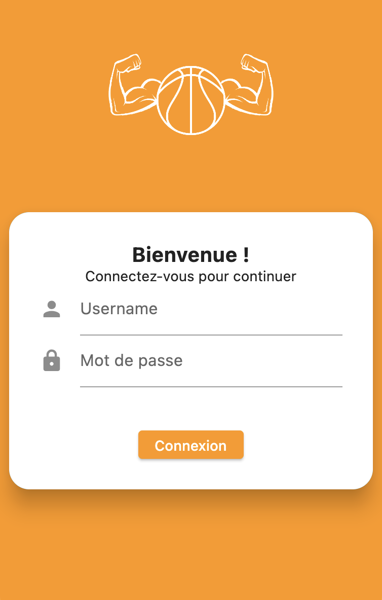

<!-- Improved compatibility of back to top link: See: https://github.com/othneildrew/Best-README-Template/pull/73 -->
<a name="readme-top"></a>
<!--
*** Thanks for checking out the Best-README-Template. If you have a suggestion
*** that would make this better, please fork the repo and create a pull request
*** or simply open an issue with the tag "enhancement".
*** Don't forget to give the project a star!
*** Thanks again! Now go create something AMAZING! :D
-->


<!-- PROJECT SHIELDS -->
<!--
*** I'm using markdown "reference style" links for readability.
*** Reference links are enclosed in brackets [ ] instead of parentheses ( ).
*** See the bottom of this document for the declaration of the reference variables
*** for contributors-url, forks-url, etc. This is an optional, concise syntax you may use.
*** https://www.markdownguide.org/basic-syntax/#reference-style-links
-->
[![`In][linkedin-shield]][linkedin-url]


<!-- PROJECT LOGO -->
<br />
<div align="center">
  <a href="https://github.com/Morbleuz/Improve-Your-Ball">
    
  </a>

  <h3 align="center">Improve Your Ball 🏀</h3>

  <p align="center">
    Suivi personnel d'un joueur de BasketBall
    <br />
    <br />
    ·
    <a href="https://github.com/Morbleuz/Improve-Your-Ball/issues">Reportez une anomalie</a>
</div>


<!-- TABLE OF CONTENTS -->
<details>
  <summary>Table des contenus</summary>
  <ol>
    <li>
      <a href="#a-propos-du-projet">À propos du projet</a>
      <ul>
        <li><a href="#creee-avec">Créée avec</a></li>
        <li><a href="#mcd">MCD</a></li>
      </ul>
    </li>
        <li><a href="#prerequisites">Prerequisites</a></li>
        <li><a href="#installation">Installation</a></li>
    <li><a href="#contributing">Contributing</a></li>
    <li><a href="#license">License</a></li>
    <li><a href="#contact">Contact</a></li>
    <li><a href="#acknowledgments">Acknowledgments</a></li>
  </ol>
</details>


<!-- ABOUT THE PROJECT -->
## A propos du projet


<div align="center">
    
</div>

Ce projet à pour but le suivi personnel d'un joueur de BasketBall.   
En vous créant un compte, vous pourrez :
* Ajouter vos rencontres 
* Voir le classement au travers des utilisateurs 
* Avoir un suivi de ses rencontres
* Accéder à une page profil, en faire les modifications

<p align="right">(<a href="#readme-top">Revenir en haut</a>)</p>


### Créer avec

Ce projet à été créée avec : 

* [![Symfony][Symfony.com]][Symfony-url]
* [![Dart][Dart.com]][Dart-url]


<p align="right">(<a href="#readme-top">Revenir en haut</a>)</p>


### MCD

Voici le MCD du projet :

<div align="center">
    
</div>


<p align="right">(<a href="#readme-top">Revenir en haut</a>)</p>


Pour pouvoir installer l'application, suivez ce tutoriel.
## Prerequis 

Pour pouvoir utiliser l'application, il vous faut une API Improve Your Ball fonctionnelle.

Il faut égalemment Flutter installer sur votre machine.

## Installation

Un exemple d'installation sur une machine 

1. Clone the repo
   ```sh
   git clone git@github.com:Morbleuz/Improve-Your-Ball.git
   ```
   
2. Mettre l'url de l'API dans le fichier /lib/model/constant.dart 
   ```dart
   static String url = "votre url";
   ```
  
3. Installer les dépendances
   ```sh
   flutter pub get
   ```
4. Lancer l'application
   ```sh
   flutter run
   ```

<p align="right">(<a href="#readme-top">Revenir en haut</a>)</p>


<!-- Ajout à venir -->
## Ajout à venir

- [ ] Ajouter la section Programme/Exercice
- [ ] Ajouter les objectifs 
- [ ] Ajouter un bouton 'showPassword'


<p align="right">(<a href="#readme-top">Revenir en haut</a>)</p>


<!-- CONTACT -->
## Contact

Laude Axel - [Linkedin](https://www.linkedin.com/in/laude-axel/) - laudeaxel.pro@gmail.com    
Martin Tom - [Linkedin](https://www.linkedin.com/in/tom-martin-a00143268/) - tommartin823@gmail.com    

<p align="right">(<a href="#readme-top">Revenir en haut</a>)</p>


<!-- MARKDOWN LINKS & IMAGES -->
<!-- https://www.markdownguide.org/basic-syntax/#reference-style-links -->
[contributors-shield]: https://img.shields.io/github/contributors/othneildrew/Best-README-Template.svg?style=for-the-badge
[contributors-url]: https://github.com/othneildrew/Best-README-Template/graphs/contributors
[forks-shield]: https://img.shields.io/github/forks/othneildrew/Best-README-Template.svg?style=for-the-badge
[forks-url]: https://github.com/othneildrew/Best-README-Template/network/members
[stars-shield]: https://img.shields.io/github/stars/othneildrew/Best-README-Template.svg?style=for-the-badge
[stars-url]: https://github.com/othneildrew/Best-README-Template/stargazers
[issues-shield]: https://img.shields.io/github/issues/othneildrew/Best-README-Template.svg?style=for-the-badge
[issues-url]: https://github.com/othneildrew/Best-README-Template/issues
[license-shield]: https://img.shields.io/github/license/othneildrew/Best-README-Template.svg?style=for-the-badge
[license-url]: https://github.com/othneildrew/Best-README-Template/blob/master/LICENSE.txt
[linkedin-shield]: https://img.shields.io/badge/-LinkedIn-black.svg?style=for-the-badge&logo=linkedin&colorB=555
[linkedin-url]: https://www.linkedin.com/in/laude-axel/
[product-screenshot]: assets/images/menu.png
[Next.js]: https://img.shields.io/badge/next.js-000000?style=for-the-badge&logo=nextdotjs&logoColor=white
[Next-url]: https://nextjs.org/
[React.js]: https://img.shields.io/badge/React-20232A?style=for-the-badge&logo=react&logoColor=61DAFB
[React-url]: https://reactjs.org/
[Vue.js]: https://img.shields.io/badge/Vue.js-35495E?style=for-the-badge&logo=vuedotjs&logoColor=4FC08D
[Vue-url]: https://vuejs.org/
[Angular.io]: https://img.shields.io/badge/Angular-DD0031?style=for-the-badge&logo=angular&logoColor=white
[Angular-url]: https://angular.io/
[Svelte.dev]: https://img.shields.io/badge/Svelte-4A4A55?style=for-the-badge&logo=svelte&logoColor=FF3E00
[Svelte-url]: https://svelte.dev/
[Laravel.com]: https://img.shields.io/badge/Laravel-FF2D20?style=for-the-badge&logo=laravel&logoColor=white
[Laravel-url]: https://laravel.com
[Bootstrap.com]: https://img.shields.io/badge/Bootstrap-563D7C?style=for-the-badge&logo=bootstrap&logoColor=white
[Bootstrap-url]: https://getbootstrap.com
[JQuery.com]: https://img.shields.io/badge/jQuery-0769AD?style=for-the-badge&logo=jquery&logoColor=white
[JQuery-url]: https://jquery.com 


[Symfony-url]: https://symfony.com/
[Symfony.com]: https://img.shields.io/badge/Symfony&ApiPlatform-12692A?style=for-the-badge&logo=Symfony&logoColor=white
[Dart-url]: https://dart.dev/ 
[Dart.com]: https://img.shields.io/badge/Dart-0769AD?style=for-the-badge&logo=dart&logoColor=white

